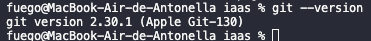
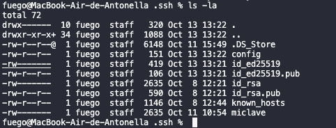
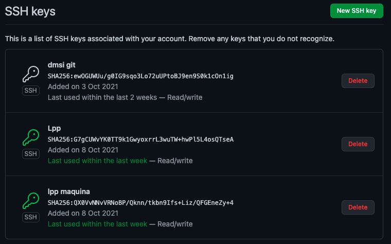
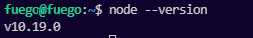
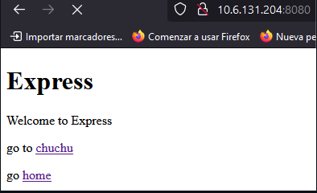
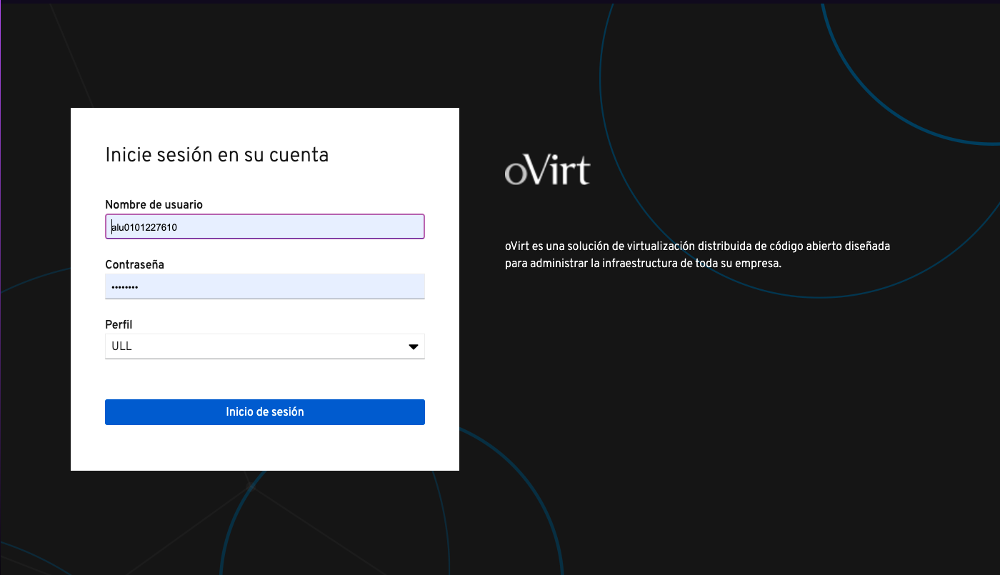
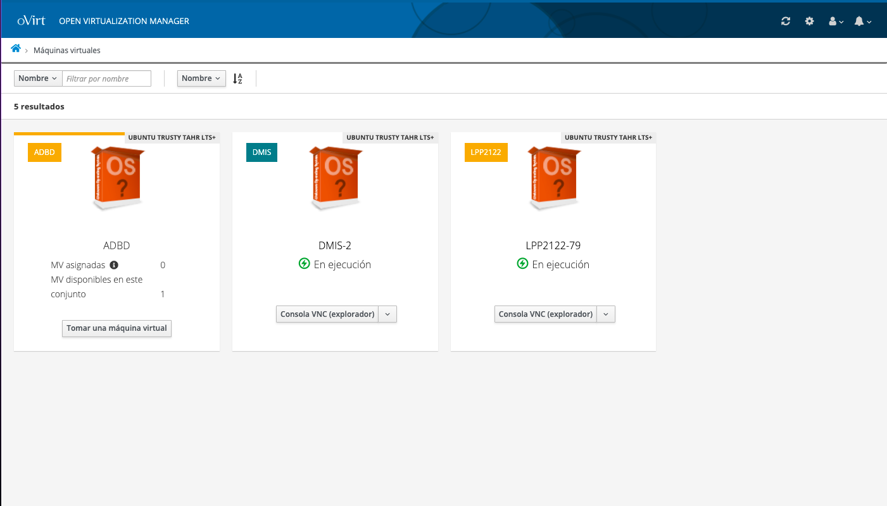
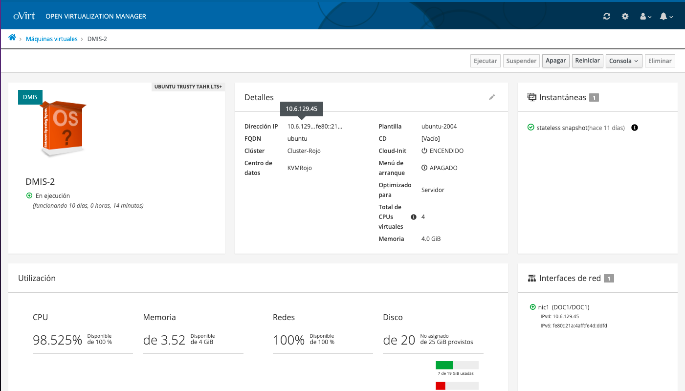

# Guía de uso del IAAS
## Desarrollo y Mantenimiento de Sistemas de la Información
#### Antonella Sofía García Álvarez
#### alu0101227610@ull.edu.es

## Configuración previa

Para empezar, depende de la máquina que utilicemos debemos instalar de una manera u otra la herramienta Homebrew. Los facilitará mucho la instalación de las dependencias que necesitamos. En mi caso, tengo un Mac, así que debo implementar este comando:

`/bin/bash -c "$(curl -fsSL https://raw.githubusercontent.com/Homebrew/install/HEAD/install.sh)"`

Esto ejecutará un script que me instalará homebrew para poder instalar en mi máquina aquellas dependencias que Apple no trae por defento.

A continuación, procedemos a la instalación de git. En algunas máquinas ya viene instalado por defecto pero si no es el caso, debemos escribir:
`sudo apt install git` o en su defecto `brew install git`

Luego para comprobar que git ha sido instalado correctamente, podemos ver que ha sido así escribiendo _git --version_:


También necesitamos configurar nuestro usuario e email para poder realizar commits:
~~~
git config --global user.name "Antonella García"
git config --global user.email "alu0101227610@ull.edu.es"
~~~
Para autenticar el uso de github, también debemos crear una clave ssh y configurarla en github. Para crearla deberemos escribir en la terminal:
`ssh-keygen -trsa`
Esto me creará, una clave pública y otra privada. La que utilizaremos en github es la pública, es decir, el fichero que termina en _.pub_.


Una vez copiada la clave, debemos escribirla en la página de github en la sección de SSH Keys:


A la hora de usar Git, una vez instalado y configurado podemos añadir otras herramientas para mejorar nuestra experiencia. Una de estas herramientas puede ser _git aliasses_ que nos permite crear alias para opciones que tengamos que repetir muchas veces: 
`git config --global alias.amend 'commit --amend'`

A continuación debemos instalar las dependencias NVM y Node. 

Para instalar el gestor de versiones de Node escribimos el siguiente comando:
`wget -qO- https://raw.githubusercontent.com/nvm-sh/nvm/v0.38.0/install.sh | bash`

Una vez instalado, podemos actualizarlo y ver la ultima version en la terminal a traves de `node --version`


Tambien existe una herramienta para detectar errores en el funcionamiento del codigo escrito en JavaScript, el cual deberiamos implementar. Para ello lo instalamos a traves de nvm:
`npm install -g jshint`

El siguiente paso es instalar RVM que es el gestor de versiones de Ruby. Para ello procedemos a escribir el siguiente comando: `sudo apt-get install software-properties-common`, despues de esto instalamos las dependencias necesarias para RVM:
```
sudo apt-add-repository -y ppa:rael-gc/rvm
sudo apt-get update
sudo apt-get install rvm
```
Continuamos instalando Ruby a traves de rvm `rvm install ruby`. Para mejorar nuestra experiencia editando en el terminal, podemos tener en cuenta el gestor de archivos para vi NERDTree, para instalarlo clonamos el repositorio:
```
git clone https://github.com/preservim/nerdtree.git ~/.vim/pack/vendor/start/nerdtree 
vim -u NONE -c "helptags ~/.vim/pack/vendor/start/nerdtree/doc" -c q
```
una vez instalado todo, ejecutamos la aplicacion de ejemplo y podemos acceder a traves del puerto 80:



## Uso de la máquina

Para comenzar, debemos saber que trabajaremos en una máquina de forma remota a la que nos conectaremos desde nuestra máquina local. Esta máquina se llama IAAS y es proporcionada por la Universidad de la Laguna, para acceder a ella debemos entrar en esta página:


Como vemos, solo se puede entrar si tenemos un correo institucional. A continuación, pasamos a ver las máquinas que tenemos asignadas según las asignaturas que tengamos:


Para empezar, elegimos la máquina de la asignatura DMSI(desarrollo y mantenimiento de sistemas de la información). Aquí podemos ver la información de la máquina así como abrir una consola para configurarla para más tarde acceder a la máquina con el ssh, ahi tenemos la ip con la cual poder entrar con `usuario@[ip]`


